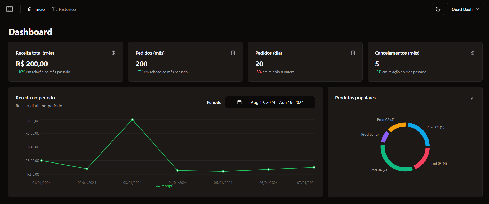
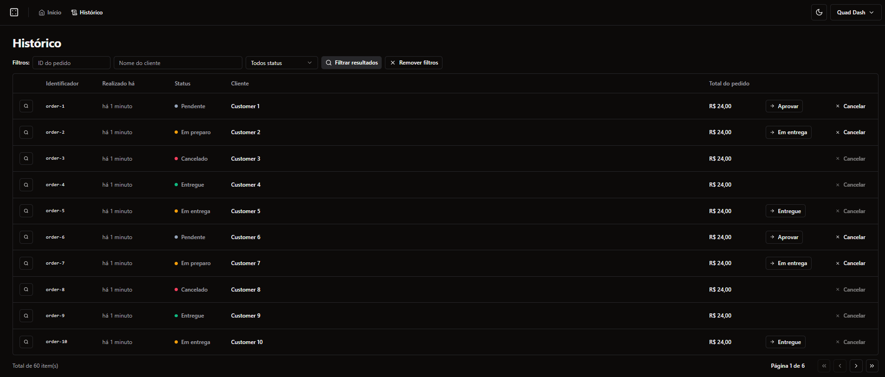

# Quad Dash 🛒📊



Welcome to the **Quad Dash Dashboard**! This project aims to provide companies and stores with an efficient and intuitive platform to manage their sales and orders. 📊

## 📋 Features

- **Company Registration**: Companies can register and start using the dashboard.
- **Sales Metrics**: Visualize sales data, including order history and trends.
- **Order Management**: Approve, cancel, and deliver orders directly from the dashboard.
- **Order History**: Track the history of each order to maintain records with details.
- **Missing Features**: Product registration is currently not implemented. Stay tuned for updates! 🚧

## 🚀 Technologies Used

- **React**: For building the user interface.
- **TypeScript**: Ensuring type safety across the application.
- **Vite**: A fast build tool for the modern web.
- **Tailwind CSS**: For styling the application with utility-first CSS.
- **React Query**: For data fetching and caching.
- **React Hook Form**: For managing form states and validations.
- **Radix UI**: For accessible and customizable UI components.
- **Zod**: For schema validation.
- **Recharts**: For data visualization.
- **Axios**: For making HTTP requests.
- **Testing**:
  - **Playwright**: For end-to-end testing.
  - **Vitest**: For unit and integration testing.
  - **Testing Library**: For testing React components.
- **Code Quality**:
  - **ESLint**: For identifying and fixing code issues.
  - **Prettier**: For maintaining code formatting.
  - **Tailwind CSS Plugin**: For better integration with Prettier.

## 🛠️ Installation
**Feel free to run out local development server.**
Backend service: https://github.com/gamadv/quad-dash-api <br>

1. **Clone the repository**:
   ```bash
   git clone https://github.com/your-username/company-ecommerce-dashboard.git
   ```
2. **Navigate to the project directory**:
   ```bash
   cd quad-dash
   ```
3. **Install dependencies**:
   ```bash
   npm install
   ```
3. **Set envs**:
   ```bash
   cp .env.example .env.local
   ```
4. **Set envs**:
   ```bash
   cp .env.example .env.local
5. *To setup backend locally follow instructions inside: https://github.com/gamadv/quad-dash-api*

6. **Run the development server**:
   ```bash
   npm run dev
   ```

## 📸 Screenshots




## 📂 Project Structure

```
📦quad-dash
 ┣ 📂public
 ┃ ┗ 📂readme
 ┃   ┣ 📜screenshot1.png
 ┃   ┗ 📜screenshot2.png
 ┣ 📂src
 ┃ ┣ 📂__tests__
 ┃ ┣ 📂components
 ┃ ┣ 📂constants
 ┃ ┣ 📂hooks
 ┃ ┣ 📂lib
 ┃ ┣ 📂pages
 ┃ ┣ 📂services
 ┃ ┣ 📂styles
 ┃ ┣ 📂text
 ┃ ┣ 📂utils
 ┃ ┗ 📜App.tsx
 ┃ ┗ 📜env.ts
 ┃ ┗ 📜routes.ts
 ┃ ┗ 📜main.tsx
 ┣ 📜package.json
 ┣ 📜env.example
 ┣ 📜index.html
 ┗ 📜vite.config.ts
```

## 🧪 How to Test the Application

Testing is a crucial part of ensuring the reliability and quality of this project. We have set up various testing tools and scripts to cover different aspects of the application:

### 🛠️ Running Tests

1. **Unit Tests**:
   ```bash
   npm run test:unit
   ```
   This script runs the unit tests using **Vitest**.

2. **End-to-End Tests (E2E)**:
   ```bash
   npm run test:e2e
   ```
   This script starts a mock server and runs E2E tests using **Playwright**.

3. **E2E Tests with UI**:
   ```bash
   npm run test:e2e-ui
   ```
   This script runs E2E tests with a graphical interface for better debugging.

4. **Linting**:
   ```bash
   npm run lint
   ```
   This script checks the code for potential errors and ensures it follows coding standards using **ESLint**.

### 🧰 Testing Tools Overview

- **Playwright**: A robust end-to-end testing framework that allows for testing across multiple browsers with features like automatic waiting, screenshots, and video recordings of tests. It’s ideal for ensuring that the application works as expected in real-world scenarios.

- **Vitest**: A fast and lightweight testing framework tailored for Vite projects. It’s similar to Jest and is used for running unit and integration tests in this project.

- **Happy Dom**: A DOM simulation library that allows you to run tests in a Node.js environment without needing a real browser. It's useful for speeding up unit tests that interact with the DOM.

- **React Testing Library**: A library for testing React components, focusing on simulating user behavior rather than implementation details. It encourages writing tests that are more aligned with how users interact with your application.

By running these tests, you can ensure that your application behaves as expected and is free from major bugs.

## 💡 Future Improvements

- Implement product registration functionality.
- Enhance the user interface with more animations and responsive design.
- Add user roles and permissions for better access control.

